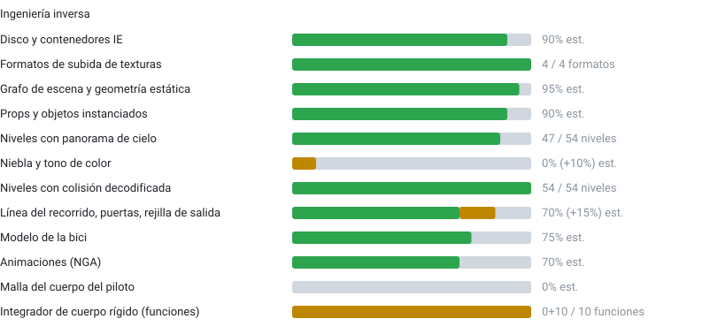
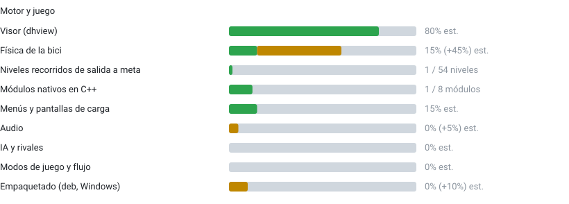

# DownHill-Port-PC

🇬🇧 [English](README.md) · 🇪🇸 Español

Un esfuerzo comunitario para llevar **Downhill Domination** (Incognito Entertainment, PS2, 2003) a los PC modernos, de forma nativa en **Linux y Windows**.

Este es un proyecto **de la comunidad y para la comunidad**. No está afiliado, respaldado ni conectado con los desarrolladores o distribuidores originales.

> **Estado: reconstrucción del motor, prototipo de física jugable.** Los 54 niveles cargan con terreno, props, cielo y colisión, y en el visor se puede recorrer ALP2 en bici de salida a meta. **Todavía no hay un juego completo**: faltan el piloto, los menús, el audio, la IA y el flujo de juego. Ver [Progreso](#progreso) y [Hoja de ruta](#hoja-de-ruta).

## Objetivo

Una reimplementación nativa del motor (no un envoltorio de emulador) que carga los datos originales del juego desde **tu propia imagen de disco obtenida legalmente** y funciona en sistemas actuales con resoluciones, controles y fluidez modernos.

## Aviso legal

- **Este repositorio no contiene datos del juego, ni código del juego, ni resultados de desensamblado o decompilación.** No se incluye ni se incluirá ninguna ISO, ejecutable, textura, modelo, audio ni video. La documentación puede citar direcciones de funciones como referencia de investigación, pero nunca contiene código del juego.
- Debes aportar **tu propia copia** del juego. Las herramientas leen tu imagen de forma local y no se sube nada a ningún sitio.
- El `.gitignore` y `tools/guard.sh` (que también corre en CI) mantienen fuera del control de versiones las imágenes de disco, los assets extraídos, el ejecutable del juego, los proyectos de Ghidra, los savestates y la salida del decompilador. **Por favor, respétalo en tus pull requests.**
- La documentación describe *formatos de archivo y estructuras* descubiertos mediante investigación de interoperabilidad. Si eres titular de derechos y tienes dudas, abre un issue.

## Progreso

<!-- progress:start -->
**Downhill Domination: 42.9% verificado, 51.7% implementado**

Promedio de todas las filas. Verificado = comprobado con evidencia del juego (savestates, la cámara del propio juego, referencia idéntica bit a bit). Implementado = funciona pero sin verificar o basado en hipótesis. Las filas con unidades muestran cifras reales; el resto son estimaciones aproximadas de los mantenedores.






<details><summary>Detalle</summary>

| Área | Detalle |
|---|---|
| Disco y contenedores IE | El descompresor funciona; faltan algunas variantes anidadas. |
| Formatos de subida de texturas | CT32 (con swizzle), T8, T4, T8H, más el enlace de materiales del PTR. |
| Grafo de escena y geometría estática | Grafo completo con rangos de visibilidad por hoja; tiras, UV, color de vértice, alfa. |
| Props y objetos instanciados | Árboles, banderas, cabaña: una copia por instancia. Comprobado con la cámara del propio juego. |
| Niveles con panorama de cielo | Los otros 7 no tienen raíz de panorama; algunos son recintos cerrados. |
| Niebla y tono de color | Parámetros sin encontrar; DH_FOG es una suposición, apagada por defecto. |
| Niveles con colisión decodificada | Cargador C++ idéntico bit a bit a la referencia en Python; los registros de impacto coinciden con los savestates (95 % mismo triángulo y normal). |
| Línea del recorrido, puertas, rejilla de salida | Línea de carrera PTS, 28 puertas en ALP2, rejilla de 10 plazas; la regla de meta es una hipótesis. |
| Modelo de la bici | Piezas ensambladas en una bici completa; faltan los datos de anclaje del esqueleto. |
| Animaciones (NGA) | Todos los tipos de pista presentes decodificados; falta el mapeo canal-hueso. |
| Malla del cuerpo del piloto | Aún sin encontrar (R/ solo tiene brazos en primera persona). |
| Integrador de cuerpo rígido (funciones) | FUN_00238818 y 9 auxiliares trazadas desde el desensamblado; sin validar contra savestates consecutivos. |
| Visor (dhview) | Cámara libre, modo caminar, cielo centrado en la cámara, modo de juego. |
| Física de la bici | Cuerpo rígido sobre el barrido y la respuesta de contacto portados (parte verificada); muchos parámetros están marcados como hipótesis. |
| Niveles recorridos de salida a meta | Solo ALP2 (28/28 puertas, autopiloto de pruebas, 0 reinicios); se puede conducir con el teclado. |
| Módulos nativos en C++ | La colisión es nativa; grafo de escena, texturas, modelos, datos del recorrido, animaciones, ensamblado de la bici y carga de niveles aún pasan por las herramientas Python. |
| Menús y pantallas de carga | Las 78 pantallas de carga se renderizan; no hay lógica de menús. |
| Audio | Archivos VAG localizados; nada decodificado en el motor. |
| IA y rivales | Sin empezar. |
| Modos de juego y flujo | Cuenta atrás, tiempos, resultados, datos de guardado. |
| Empaquetado (deb, Windows) | Solo el andamiaje de CPack. |

</details>

Datos de origen: [`docs/progress.json`](docs/progress.json), se regeneran con `python3 tools/progress.py`.
<!-- progress:end -->

Las notas de formatos están en [`docs/es/formats.md`](docs/es/formats.md) y [`docs/formats/`](docs/formats/) (colisión, instanciación de escena, física de la bici, integrador, animaciones, marcadores y más). La configuración de Ghidra y el flujo de investigación están en [`docs/es/research.md`](docs/es/research.md); la arquitectura y la decisión de lenguaje, en [`docs/es/architecture.md`](docs/es/architecture.md); las decisiones de diseño se registran en [`docs/DECISIONS.md`](docs/DECISIONS.md). Todo existe también en inglés en [`docs/en/`](docs/en/).

## Hoja de ruta

| # | Hito | Estado |
|---|------|--------|
| 1 | **Mapa fiel**: niveles con textura, props, cielo, comparados con la cámara del propio juego | Hecho |
| 2 | **Colisión completa**: transformaciones de instancia, respuesta de contacto | Hecho |
| 3 | **Bici jugable**: física, control por teclado, ALP2 de salida a meta | Prototipo (parámetros en parte hipótesis; integrador fiel pendiente de validar) |
| 4 | **Piloto animado**: malla del cuerpo y mapeo canal–hueso | Siguiente |
| 5 | **Motor nativo**: cargadores C++ en lugar del paso Python; decisión de lenguaje (C++ o Rust) | Pending |
| 6 | **Flujo de juego**: menús, carga, cuenta atrás, meta, tiempos, rivales | Pending |
| 7 | **Empaquetado**: compilaciones `.deb` y de Windows. El paquete **no** incluirá datos del juego; la aplicación extraerá los assets de tu imagen en el primer arranque | Pending |

## Probarlo

Necesitas **tu propia imagen de disco obtenida legalmente** de la versión PAL (`SLES_522.02`). Nada del juego se incluye en este repositorio ni se sube a ningún sitio.

```sh
python3 tools/dh.py doctor                                   # comprueba dependencias y estado
python3 tools/dh.py setup "Downhill Domination.iso"          # extrae, descomprime, exporta ALP2 + ALPINEMX y compila el visor
python3 tools/dh.py play                                     # conduce en ALP2 (o: play ALPINEMX)
python3 tools/dh.py setup "Downhill Domination.iso" --all    # opcional: los 54 niveles (unos 4 GB, varios minutos)
```

`setup` necesita Python 3 con Pillow y NumPy, 7-Zip (`7z`, `7zz` o `7za`) o `bsdtar`, CMake, un compilador C++20 y los archivos de desarrollo de SDL3 y OpenGL. Escribe solo en `iso_extract/`, `unpacked/`, `out/` y `build/`, todas ignoradas por git, y se puede repetir sin riesgo: los pasos terminados se saltan. Controles: `W` acelerar, `S` frenar, `A`/`D` girar, `Q`/`E` inclinar, `Espacio` saltar, `Enter` reaparecer en el último punto bueno, `T` volver a la salida, `Esc` salir.

Es un prototipo de física: todavía no hay piloto, menús, audio ni rivales, y varios parámetros de la física son hipótesis (ver [Progreso](#progreso)). Probado en Linux; en Windows debería funcionar igual, pero aún no se ha probado.

## Compilación

Requisitos: compilador C++20, CMake ≥ 3.20, Ninja y los archivos de desarrollo de SDL3 y OpenGL.

```sh
cmake -S . -B build -G Ninja -DCMAKE_BUILD_TYPE=Release
cmake --build build
cd build && ctest                    # pruebas unitarias de suelo, contacto, bici e integrador
./build/dhview nivel.mdl             # WASD + ratón, Shift = rápido, F = volar/caminar, Esc = salir
```

Probar el prototipo en un nivel que hayas exportado (ver el flujo más abajo):

```sh
DH_PLAY=1 DH_BIKE=out/play/bike1.mdl ./build/dhview out/maps/ALP2.mdl
# W acelerar · S frenar · A/D girar · Q/E inclinar · Espacio saltar · Enter reiniciar en el último punto bueno · T volver a la salida
```

Variables de entorno útiles: `DH_COLDRAW=1` dibuja la malla de colisión, `DH_NOSKY=1` oculta el cielo, `DH_FOG="r g b inicio fin"` activa la niebla experimental.

Empaquetado (sin datos del juego): `cd build && cpack -G DEB`.

## Herramientas

Python 3 con Pillow y NumPy basta para todo lo que hay en `tools/`. Python se usa sólo para investigación y conversión offline; el motor de ejecución es C++ (la discusión de lenguaje, incluido un posible paso a Rust, está en [`docs/es/architecture.md`](docs/es/architecture.md)).

| Herramienta | Para qué sirve |
|-------------|----------------|
| `tools/dh.py` | Script único: `doctor`, `setup` (de la ISO a niveles jugables y visor) y `play` |
| `tools/unpack_ie.py` | Descomprime los contenedores `IE` de una carpeta de disco extraída |
| `tools/tex_dump.py`, `tools/tex_export.py` | Inspeccionan y exportan texturas (`gs.py` tiene las tablas de swizzle del GS) |
| `tools/vif.py`, `tools/vudis.py` | Decodificador de paquetes VIF; desensamblador del microcódigo VU1 |
| `tools/scene.py` | Recorredor del grafo de escena de `.NGP`; `walk_payloads` / `Owners` dan las transformaciones por visita y el filtro de detalle fino |
| `tools/scene_html.py` | Vuelca el grafo de escena de un nivel como árbol HTML plegable (solo estructura, sin datos del juego) |
| `tools/extract_model.py` | Genera un `.mdl` con textura (malla, materiales, paletas, color de vértice) y el panorama de cielo/horizonte `.dome.mdl` de un nivel |
| `tools/export_all.sh` | Exporta todos los niveles (modelo, colisión con instancias, puertas, rejilla de salida) a `out/maps/` |
| `tools/collision.py` | Malla de colisión (nodos `0x2A`/`0x0A`) con colocación de instancias; `--instances` es la exportación correcta |
| `tools/markers.py`, `tools/pts_path.py`, `tools/ptsext.py` | Puertas, rejilla de salida, línea de carrera `.PTS` y sus datos hermanos |
| `tools/nga.py` | Decodificador de pistas de animación (`.NGA`) |
| `tools/assemble_bike.py` | Ensambla una bici a partir de piezas `.mdl` de cuadro, horquilla y rueda |
| `tools/contact_sheet.py`, `tools/compare_view.py` | Hojas de contacto de muchos modelos; render lado a lado contra la captura de un savestate de PCSX2 con la cámara del propio juego |
| `tools/p2s.py`, `tools/p2s_check.py`, `tools/pcsx2/` | Lector de savestates de PCSX2, comparación con los datos del propio motor, scripts de captura en vivo por PINE |
| `tools/integrator_check.py` | Compara la reimplementación del integrador de cuerpo rígido con savestates |
| `tools/guard.sh` | Falla si hay datos del juego, archivos grandes, rutas personales o secretos versionados (corre en CI) |
| `tools/ghidra/` | Scripts de Ghidra en modo headless (xrefs de cadenas, decompilación, listados de instrucciones) |

La ingeniería inversa usa [Ghidra](https://ghidra-sre.org/) con la extensión comunitaria [ghidra-emotionengine-reloaded](https://github.com/chaoticgd/ghidra-emotionengine-reloaded) (lenguaje `r5900:LE:32:default`) y savestates de [PCSX2](https://pcsx2.net/) como referencia de verdad.

Flujo típico:

```sh
7z x "Downhill Domination.iso" -oiso_extract
python3 tools/unpack_ie.py iso_extract unpacked
sh tools/export_all.sh               # todos los niveles en out/maps/
./build/dhview out/maps/ALP2.mdl
```

## Contribuir

Lee primero [`CONTRIBUTING.md`](CONTRIBUTING.md) y [`SECURITY.md`](SECURITY.md) (ambos bilingües).

Las contribuciones son muy bienvenidas, en especial:

- Ingeniería inversa: la malla del cuerpo del piloto, el mapeo canal–hueso de `.NGA`, los parámetros de niebla, formatos (`.RST`, `.REP`, `.BNK`, `.SKX`, ...), lógica del juego.
- Validar el integrador de cuerpo rígido: pares de savestates con unos pocos fotogramas de diferencia y la bici en el aire (ver [`docs/formats/integrator.md`](docs/formats/integrator.md)).
- Renderizado y trabajo de motor en C++.
- Pruebas con otras versiones PAL/NTSC del juego (hasta ahora sólo se ha examinado la compilación PAL `SLES_522.02`).
- Documentación de todo lo que descubras.

Reglas básicas:

1. Nunca subas datos del juego, ejecutables, assets extraídos, savestates ni salida del decompilador.
2. Documenta los hallazgos en `docs/en/` y `docs/es/` (o `docs/formats/`) con tus propias palabras (estructuras y significado de los campos, no código copiado). Cita la dirección de la función o márcalo como hipótesis.
3. Mantén las herramientas pequeñas y ejecutables; una comprobación corta vale más que una explicación larga.

## Agradecimientos

Gracias a las comunidades de PCSX2 y Ghidra, y a todas las personas que han documentado el hardware de la PS2 (GS, VIF, VU) a lo largo de los años.

## Autoría

Creado y mantenido por **Pedro Soto**, con contribuciones de la comunidad (ver [`AUTHORS`](AUTHORS)).

## Licencia

Copyright (C) 2026 Pedro Soto y las personas que contribuyen a DownHill-Port-PC.

El código de este repositorio se publica bajo la **Licencia Pública General de GNU v3.0 o posterior** (ver [`LICENSE`](LICENSE)). Las contribuciones se aceptan bajo la misma licencia.

Esta licencia cubre únicamente el código y la documentación de este repositorio. Los assets, el código y las marcas del juego pertenecen a sus respectivos titulares y no están incluidos.
