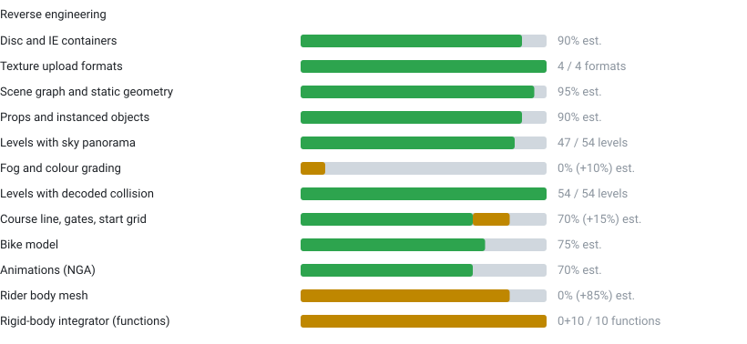
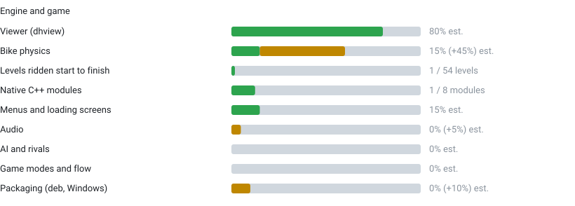

# DownHill-Port-PC

🇬🇧 English · 🇪🇸 [Español](README.es.md)

A community-driven effort to bring **Downhill Domination** (Incognito Entertainment, PS2, 2003) to modern PCs, natively on **Linux and Windows**.

This is a project **by the community, for the community**. It is not affiliated with, endorsed by, or connected to the original developers or publishers.

> **Status: engine reconstruction, playable physics prototype.** All 54 levels load with terrain, props, sky and collision, and a bike can be ridden down ALP2 from start to finish in the viewer. There is **no complete game yet**: the rider, menus, audio, AI and game flow are still missing. See [Progress](#progress) and [Roadmap](#roadmap).

## Goal

A native engine reimplementation (not an emulator wrapper) that loads the game's original data from **your own legally obtained disc image**, and runs on current systems with modern resolutions, input and frame pacing.

## Legal notice

- **This repository contains no game data, no game code and no disassembly or decompilation output.** No ISO, executable, textures, models, audio or video are, or will ever be, included. Docs may cite function addresses as research references; they never contain game code.
- You must supply **your own copy** of the game. The tools read your image locally and nothing is uploaded anywhere.
- `.gitignore` and `tools/guard.sh` (also run in CI) keep disc images, extracted assets, the game executable, Ghidra projects, savestates and decompiler output out of version control. **Please keep it that way in pull requests.**
- Documentation here describes *file formats and structures* discovered through interoperability research. If you are a rights holder and have concerns, please open an issue.

## Progress

<!-- progress:start -->
**Downhill Domination: 42.9% verified, 55.8% implemented**

Average of all rows. Verified = checked against evidence from the game (savestates, the game's own camera, bit-identical reference). Implemented = works but unverified or based on hypotheses. Counted rows show real units; the rest are rough maintainer estimates.






<details><summary>Detail</summary>

| Area | Detail |
|---|---|
| Disc and IE containers | Unpacker works; a few nested variants pending. |
| Texture upload formats | CT32 (swizzled), T8, T4, T8H, plus the PTR material link. |
| Scene graph and static geometry | Whole graph with per-leaf visibility ranges; strips, UVs, vertex colour, alpha. |
| Props and instanced objects | Trees, flags, cabin: one copy per instance. Checked against the game's own camera. |
| Levels with sky panorama | The other 7 have no panorama root; some are enclosed arenas. |
| Fog and colour grading | Parameters not found; DH_FOG is a guess, off by default. |
| Levels with decoded collision | C++ loader bit-identical to the Python reference; hit records match savestates (95% same triangle and normal). |
| Course line, gates, start grid | PTS racing line, 28 gates in ALP2, 10-slot grid; the finish rule is a hypothesis. |
| Bike model | Parts assembled into a full bike; skeleton attachment data pending. |
| Animations (NGA) | All present track types decoded; channel-to-bone mapping pending. |
| Rider body mesh | Found in each level NGP (kinds 4030-4130, 13 models in ALP2); skinning decoded from the VU1 code and posed with BANIM clips; not yet compared with the game. |
| Rigid-body integrator (functions) | FUN_00238818 and 9 helpers traced from the disassembly. FUN_00238818 is validated for FREE FLIGHT only: the C++ port with the engine constants read from the ELF (FUN_00134060: damping 0.975/0.987, G = -96.6000061; no fit) matches 4 captures x 50 consecutive ticks to ~1 float32 ulp. Contacts and impacts not validated, so counted as wip, not done. |
| Viewer (dhview) | Free camera, walk mode, camera-centred sky, play mode. |
| Bike physics | Rigid body on the ported sweep and contact response (verified part); many parameters are labelled hypothesis. |
| Levels ridden start to finish | ALP2 only (28/28 gates, test autopilot, 0 resets); keyboard riding works. |
| Native C++ modules | Collision is native; scene graph, textures, models, course data, animations, bike assembly and level loading still go through the Python tools. |
| Menus and loading screens | 78 loading screens render; no menu logic. |
| Audio | VAG files located; nothing decoded in the engine. |
| AI and rivals | Not started. |
| Game modes and flow | Countdown, timing, results, save data. |
| Packaging (deb, Windows) | CPack scaffolding only. |

</details>

Source data: [`docs/progress.json`](docs/progress.json), regenerate with `python3 tools/progress.py`.
<!-- progress:end -->

Format notes live in [`docs/en/formats.md`](docs/en/formats.md) and [`docs/formats/`](docs/formats/) (collision, scene instancing, bike physics, integrator, animations, markers and more). The Ghidra setup and research workflow are in [`docs/en/research.md`](docs/en/research.md); architecture and the language decision are in [`docs/en/architecture.md`](docs/en/architecture.md); design decisions are logged in [`docs/DECISIONS.md`](docs/DECISIONS.md). Everything is also available in Spanish under [`docs/es/`](docs/es/).

## Roadmap

| # | Milestone | State |
|---|-----------|-------|
| 1 | **Faithful map**: textured levels, props, sky, compared against the game's own camera | Done |
| 2 | **Complete collision**: instance transforms, contact response | Done |
| 3 | **Playable bike**: physics, keyboard control, ALP2 start to finish | Prototype (parameters partly hypothesis; faithful integrator pending validation) |
| 4 | **Animated rider**: body mesh and channel-to-bone mapping | In progress: mesh, skeleton, skinning and upper-body pose decoded (offline tools); legs, bike attachment and viewer integration pending |
| 5 | **Native runtime**: C++ loaders replace the Python step (language decided: C++20) | Pending |
| 6 | **Game flow**: menus, loading, countdown, finish, times, rivals | Pending |
| 7 | **Packaging**: `.deb` and Windows builds. The package will **not** ship game data; the app will extract assets from your image on first run | Pending |

## Try it

You need **your own legally obtained disc image** of the PAL release (`SLES_522.02`). Nothing from the game is ever included in this repository or uploaded anywhere.

```sh
python3 tools/dh.py doctor                                   # checks dependencies and state
python3 tools/dh.py setup "Downhill Domination.iso"          # extract, unpack, export ALP2 + ALPINEMX, build the viewer
python3 tools/dh.py play                                     # ride ALP2 (or: play ALPINEMX)
python3 tools/dh.py setup "Downhill Domination.iso" --all    # optional: all 54 levels (about 4 GB, several minutes)
```

`setup` needs Python 3 with Pillow and NumPy, 7-Zip (`7z`, `7zz` or `7za`) or `bsdtar`, CMake, a C++20 compiler and the SDL3 and OpenGL development files. It writes only to `iso_extract/`, `unpacked/`, `out/` and `build/`, all ignored by git, and can be re-run safely: finished steps are skipped. Controls: `W` accelerate, `S` brake, `A`/`D` steer, `Q`/`E` lean, `Space` jump, `Enter` respawn at the last good point, `T` back to the start, `Esc` quit.

This is a physics prototype: no rider, menus, audio or opponents yet, and several physics parameters are hypotheses (see [Progress](#progress)). Tested on Linux; Windows should work the same way but has not been tried yet.

## Building

Requirements: a C++20 compiler, CMake ≥ 3.20, Ninja, SDL3 and OpenGL development files.

```sh
cmake -S . -B build -G Ninja -DCMAKE_BUILD_TYPE=Release
cmake --build build
cd build && ctest                    # ground, contact, bike and integrator unit tests
./build/dhview level.mdl             # WASD + mouse, Shift = fast, F = fly/walk, Esc = quit
```

Play the prototype on a level you exported (see the workflow below):

```sh
DH_PLAY=1 DH_BIKE=out/play/bike1.mdl ./build/dhview out/maps/ALP2.mdl
# W accelerate · S brake · A/D steer · Q/E lean · Space jump · Enter restart at last good point · T back to the start
```

Useful environment variables: `DH_COLDRAW=1` draws the collision mesh, `DH_NOSKY=1` hides the sky, `DH_FOG="r g b start end"` enables the experimental fog.

Packaging (no game data included): `cd build && cpack -G DEB`.

## Tools

Python 3 with Pillow and NumPy is enough for everything in `tools/`. Python is used only for research and offline conversion; the runtime is C++ (see [`docs/en/architecture.md`](docs/en/architecture.md) for the language discussion, where Rust was considered and dropped).

| Tool | Purpose |
|------|---------|
| `tools/dh.py` | One-stop script: `doctor`, `setup` (ISO to playable levels and viewer) and `play` |
| `tools/unpack_ie.py` | Inflate the `IE` containers from an extracted disc folder |
| `tools/tex_dump.py`, `tools/tex_export.py` | Inspect and export textures (`gs.py` has the GS swizzle tables) |
| `tools/vif.py`, `tools/vudis.py` | VIF packet decoder; VU1 microcode disassembler |
| `tools/scene.py` | Scene-graph walker for `.NGP`; `walk_payloads` / `Owners` give per-visit transforms and the fine-detail filter |
| `tools/scene_html.py` | Dump a level's scene graph as a collapsible HTML tree (structure only, no game data) |
| `tools/extract_model.py` | Build a textured `.mdl` (mesh, materials, palettes, vertex colour) plus the sky/horizon `.dome.mdl` from a level |
| `tools/export_all.sh` | Export every level (model, collision with instances, gates, start grid) to `out/maps/` |
| `tools/collision.py` | Collision mesh (nodes `0x2A`/`0x0A`) with instance placement; `--instances` is the correct export |
| `tools/markers.py`, `tools/pts_path.py`, `tools/ptsext.py` | Gates, start grid, `.PTS` racing line and its sibling data |
| `tools/nga.py` | Animation (`.NGA`) track decoder |
| `tools/assemble_bike.py` | Assemble a bike from frame, fork and wheel `.mdl` parts |
| `tools/contact_sheet.py`, `tools/compare_view.py` | Contact sheets of many models; side-by-side render against a PCSX2 savestate screenshot using the game's own camera |
| `tools/p2s.py`, `tools/p2s_check.py`, `tools/pcsx2/` | PCSX2 savestate reader, comparison against the engine's own data, PINE live-capture scripts |
| `tools/integrator_check.py` | Compare the rigid-body integrator reimplementation with savestates |
| `tools/guard.sh` | Fail if game data, large files, personal paths or secrets are versioned (runs in CI) |
| `tools/ghidra/` | Headless Ghidra scripts (string xrefs, decompilation, instruction listings) |

Reverse engineering uses [Ghidra](https://ghidra-sre.org/) with the community [ghidra-emotionengine-reloaded](https://github.com/chaoticgd/ghidra-emotionengine-reloaded) extension (language `r5900:LE:32:default`) and [PCSX2](https://pcsx2.net/) savestates as ground truth.

Typical workflow:

```sh
7z x "Downhill Domination.iso" -oiso_extract
python3 tools/unpack_ie.py iso_extract unpacked
sh tools/export_all.sh               # all levels into out/maps/
./build/dhview out/maps/ALP2.mdl
```

## Contributing

See [`CONTRIBUTING.md`](CONTRIBUTING.md) and [`SECURITY.md`](SECURITY.md) first.

Contributions are very welcome, especially:

- Reverse engineering: the rider body mesh, `.NGA` channel-to-bone mapping, fog parameters, formats (`.RST`, `.REP`, `.BNK`, `.SKX`, ...), game logic.
- Validating the rigid-body integrator: pairs of savestates a few frames apart with the bike in the air (see [`docs/formats/integrator.md`](docs/formats/integrator.md)).
- Rendering and engine work in C++.
- Testing on different PAL/NTSC releases of the game (so far only the PAL `SLES_522.02` build has been examined).
- Documentation of anything you figure out.

Ground rules:

1. Never commit game data, executables, extracted assets, savestates or decompiler output.
2. Document findings in both `docs/en/` and `docs/es/` (or `docs/formats/`) in your own words (structures and field meanings, not copied code). Cite the function address, or label it as a hypothesis.
3. Keep tools small and runnable; a short check beats a long explanation.

## Acknowledgements

Thanks to the PCSX2 and Ghidra communities, and to everyone who has documented the PS2 hardware (GS, VIF, VU) over the years.

Part of the disassembly analysis was supported by code-reading assistive tools; every claim is marked as a hypothesis until validated by a script against the game.

## Authors

Created and maintained by **Pedro Soto**, with contributions from the community (see [`AUTHORS`](AUTHORS)).

## License

Copyright (C) 2026 Pedro Soto and the DownHill-Port-PC contributors.

The code in this repository is licensed under the **GNU General Public License v3.0 or later** (see [`LICENSE`](LICENSE)). Contributions are accepted under the same license.

This license covers only the code and documentation in this repository. Game assets, code and trademarks belong to their respective owners and are not included.
